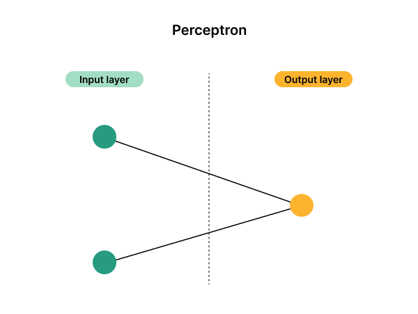
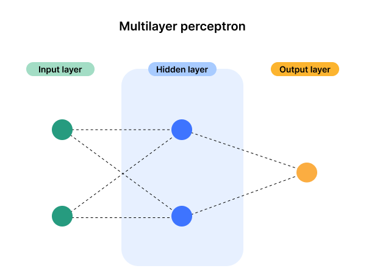

# Podstawowe pojęcia związane z sieciami neuronowymi
**Sieć neuronowa** - to rodzaj architektury obliczeniowej opartej na modelu funkcjonowania ludzkiego mózgu — stąd nazwa „neuronowa”. 

Sieci neuronowe składają się z zespołu jednostek przetwarzających zwanych **perceptronami**. Perceptrony te przekazują sobie nawzajem dane, podobnie jak neurony w mózgu przekazują sobie impulsy elektryczne.

Zasada działania perceptronu: 

1. Każdy perceptron posiada wejścia, do których przypisana jest waga.
2. Obliczana jest ich suma ważona.
3. Do sumy dodawany jest **bias** (jakaś liczba rzeczywista, coś jak wyraz wolny funkcji).
4. Otrzymany wynik podawany jest do **funkcji aktywacji**, a jej wynik jest przekazywany dalej.

Obliczenia perceptronu można opisać za pomocą takiego wzoru: 
$$ y = f\left(\sum_{i=1}^{n} w_i x_i + b \right) $$

## Trening sieci neuronowej
Trening sieci neuronowej polega na dobraniu wag i biasów perceptronów, tak aby uzyskać jak największą dokładność predykcji.

## Klasyfikacja sieci neuronowych 
Podział sieci neuronowych ze względu na głębokość:
* Płytkie sieci neuronowe - zawierają maksymalnie jedną warstwę ukrytą.
* Głębokie sieci neuronowe - zawierają więcej niż jedną warstwę ukrytą.

Podział sieci neuronowych ze względu na architekturę:
* [Jednowarstwowe sieci neuronowe](#jednowarstwowe-sieci-neuronowe)
* [Sieci MLP](#sieć-mlp-multi-layer-perceptron)
* [Sieci konwolucyjne](#konwolucyjne-sieci-neuronowe-cnn)

### Jednowarstwowe sieci neuronowe
Zbudowane z jednej warstwy uczącej, bez warstw ukrytych.

Warstwa wejściowa (pseudowarstwa) służy wyłącznie do wprowadzania danych. Nie przeprowadza żadnych obliczeń.

Najprostszym przykładem takiej sieci jest pojedynczy perceptron.

### Sieć MLP (Multi-Layer Perceptron)
Sieć MLP może być siecią płaską lub głęboką.

W sieciach MLP perceptrony przekazują wyniki swoich obliczeń kolejnym perceptronom w następnych warstwach.

### Konwolucyjne sieci neuronowe (CNN)
